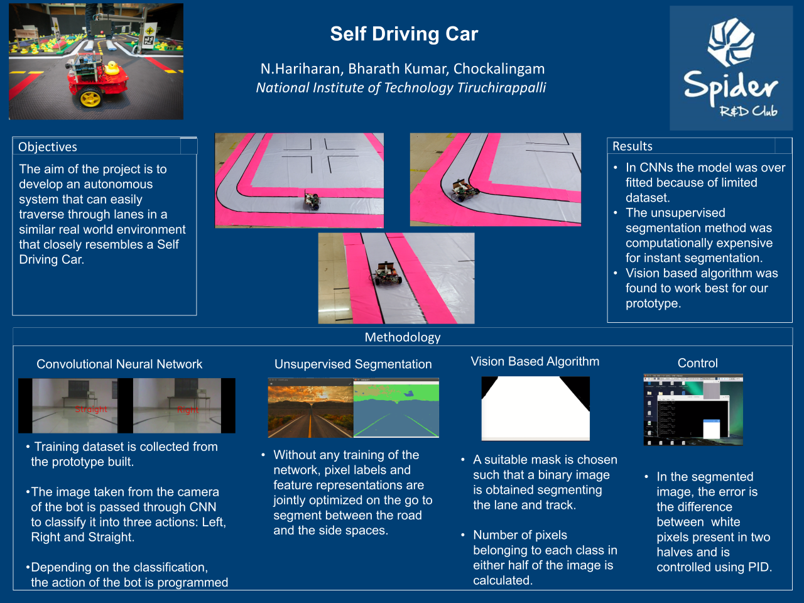

# RC_Self_Driving
## Self Driving Car using Convolutional Neural Network and Reinforcement Q-Learning.
                                                                         
In this project, by giving camera feed as input for a CNN we define states and the output from a fully connected network are 
Q-values for each possible action. Then we update the Q-table using Bellman equation and update the weights using
backpropagation.                                                                                   

I have created my own dataset. By using canny edge detection we can obtain good feature for lane states. And I have trained
it using 5 layer deep CNN without Pooling.

## To Create Training data-set:
1. Download data: https://drive.google.com/open?id=1tMKej5sr3zW5kGLqi4Qg080lJAhpJayv
2. Run Dataset_create.py

## To Train:
1. Run CNN_state_classification.py                                                                                           
  Now we have obtained the trained model for the bot states. After this, we have to test the trained model with a lane
  testing video.
.
## To Test:
1. Now run lane_state_cnn.py                                                                    
  Now we will obtain a video which gives information about the bot states. Using this the bot can autonomously keeps the
  lane. But for robust driving there must be multiple states and Q-learning should be implemented.  

Future Work:                                                                                        
  For a present state, the output from a fully connected network are Q-values for each possible action. Then we update the 
  Q-table using Bellman equation and update the weights using backpropagation.

  Algorithms need to be implemented:
  * Do a feedforward pass for the current state s to get predicted Q-values for all actions.
  * Do a feedforward pass for the next state s’ and calculate maximum overall network outputs max a’ Q(s’, a’).
  * Set Q-value target for action to r + γmax a’ Q(s’, a’) (use the max calculated in step 2). For all other actions, set the 
  * Q-value target to the same as originally returned from step 1, making the error 0 for those outputs.
  * Update the weights using backpropagation.
  
  Till now we constrained states as Left, Right and Straight. In future work, there will be multiple states.
  
  
